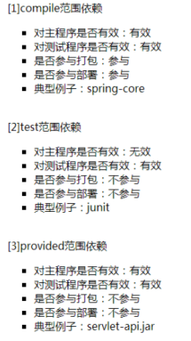
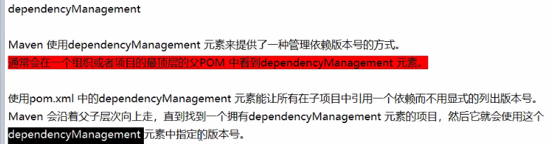
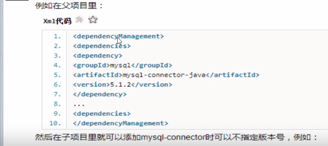
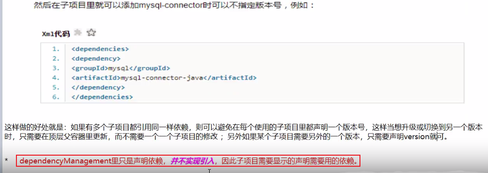

### 一，Maven约定的目录结构

```txt
maven_project01 : 根目录：项目名
	|----src
	|----|----main
	|----|----|----java
	|----|----|----|----com.myproject.controller.xxxController.java
	|----|----|----resources
	|----|----test
	|----|----|----java
	|----|----|----|----com.myproject.controller.xxxTest.java //test程序路径必须的被测程序相同
	|----|----|----resources
	|----pom.xml
```


### 二，Maven常用命令

**maven执行任何命令都会把这个命令之前的命令从头执行一边**

1，注意，测试类代码的路径必须和被测试的类代码路径一直，否则报错

2，Maven中坐标的含义：
   pom.xml文件中的标签：简称gav

```xml
<groupId>com.maven.test</groupId>    <!--表示公司或组织域名倒叙，g-->
<artifactId>MyMaven</artifactId>     <!--模块名，a-->
<version>0.0.1-SNAPSHOT</version>    <!--版本名，v-->

```
**maven执行打包package命令后， 打成的包名由artifactId和version组成**

3，Maven常用命令，及其执行顺序是从上到下，dos窗口必须在pom.xml同一目录下代开运行命令
    mvn clean : 清理，会删除原先的target目录，即删除了旧的老版本的.class文件
    mvn compile : 编译项目内的代码
    mvn test-compile : 编译测试程序
    mvn test : 执行测试
    mvn package : 打包
    mvn install : 安装，导出到本地的Maven仓库

4，mvn package : 命令会把编译好的文件压缩成jar包放到target文件夹里

5，mvn install : 这个命令会把编译好的jar包导入，也称安装到Maven本地仓库中，便于其他的工程依赖使用。

### 三，Maven的设置文件settings.xml设置参数

```xml
<settings xmlns="http://maven.apache.org/SETTINGS/1.0.0"
          xmlns:xsi="http://www.w3.org/2001/XMLSchema-instance"
          xsi:schemaLocation="http://maven.apache.org/SETTINGS/1.0.0 http://maven.apache.org/xsd/settings-1.0.0.xsd">
  <!-- localRepository
   | The path to the local repository maven will use to store artifacts.
   |
   | Default: ${user.home}/.m2/repository 
   | 设置下载依赖本地保存目录，如不设置，默认是上面的地址-->
  <localRepository>F:\maven_repository</localRepository>  
    .....
<!--设置远程仓库，一般设置一个就行-->    
    <mirrors>
        <mirror>
            <id>aliyunmaven</id>
            <mirrorOf>*</mirrorOf>
            <name>阿里云公共仓库</name>
            <url>https://maven.aliyun.com/repository/public</url>
        </mirror>
        <mirror>
            <id>nexus-aliyun</id>
            <mirrorOf>central</mirrorOf>
            <name>Nexus aliyun</name>
            <url>http://maven.aliyun.com/nexus/content/groups/public</url> 
        </mirror>	
    </mirrors>
```

### 四，Maven的依赖

如果maven_project02中使用到了maven_project01中的类，须在maven_project01执行install命令，并且再maven_project02的pom.xml中加入01的依赖。

Maven根据pom文件设置获取依赖的路径是: 现在本地仓库找，本地没有再去maven的setting.xml里制定的线上仓库里找。

```xml
<dependency>
    <groupId>com.maven</groupId>
    <artifactId>maven_project01</artifactId>  
</dependency>
```

### 五，\<scope\>

如果junit依赖设置范围为test，则在项目中的主程序类中使用test包下的类就会报错，因为test对主程序无效

```xml
<dependency>
    <groupId>junit</groupId>
    <artifactId>junit</artifactId>
    <version>4.0</version>
    <scope>test</scope>
</dependency>
```



Dependency [scope](https://maven.apache.org/guides/introduction/introduction-to-dependency-mechanism.html) is used to limit the transitivity of a dependency and to determine when a dependency is included in a classpath.  

There are 6 scopes:  

- **compile**
  This is the default scope, used if none is specified. Compile dependencies are available in all classpaths of a project. Furthermore, those dependencies are propagated to dependent projects.
- **provided**
  This is much like `compile`, but indicates you expect the JDK or a container to provide the dependency at runtime. For example, when building a web application for the Java Enterprise Edition, you would set the dependency on the Servlet API and related Java EE APIs to scope `provided` because the web container provides those classes. A dependency with this scope is added to the classpath used for compilation and test, but not the runtime classpath. It is not transitive.
- **runtime**
  This scope indicates that the dependency is not required for compilation, but is for execution. Maven includes a dependency with this scope in the runtime and test classpaths, but not the compile classpath.
- **test**
  This scope indicates that the dependency is not required for normal use of the application, and is only available for the test compilation and execution phases. This scope is not transitive. Typically this scope is used for test libraries such as JUnit and Mockito. It is also used for non-test libraries such as Apache Commons IO if those libraries are used in unit tests (src/test/java) but not in the model code (src/main/java).
- **system**
  This scope is similar to `provided` except that you have to provide the JAR which contains it explicitly. The artifact is always available and is not looked up in a repository.
- **import**
  This scope is only supported on a dependency of type `pom` in the `` section. It indicates the dependency is to be replaced with the effective list of dependencies in the specified POM's `` section. Since they are replaced, dependencies with a scope of `import` do not actually participate in limiting the transitivity of a dependency.


### 六，新加Maven模块注意事项

1，idea新加的模块的父工程Parent设置为空，后期再加；

2，加完之后，注意检查新加模块的pom.xml，添加父工程模块

```xml
<!--父工程模块-->
<parent>
    <groupId>com.jeesite</groupId>
    <artifactId>jeesite-parent</artifactId>
    <version>5.0.1-SNAPSHOT</version>
    <relativePath>../parent/pom.xml</relativePath>
</parent>
```

3，在Maven列表里，新加的模块后面有个"root"，需在父工程模块的pom.xml里添加子模块声明，才可消失

```xml
<module>../weixin</module>
```

4，注意idea添加子模块后，会在父工程的pom.xml里自动加上下面的内容，是错误的，需删掉

```xml
<parent>
    <groupId>com.jeesite</groupId>
    <artifactId>jeesite-weixin</artifactId>
</parent>
```

### 七，\<dependencyManagement>和\<dependencies>的区别








### 八，Maven打war包的依赖与Tomcat冲突问题

如果使用Maven打war包，放到Tomcat中部署项目，注意相关的依赖，如servlet-api.jar，jsp-api.jar，el-api.jar等的\<scope\>要设置为provide，因为Tomcat服务器有这些jar包，否则启动项目会冲突，报错。